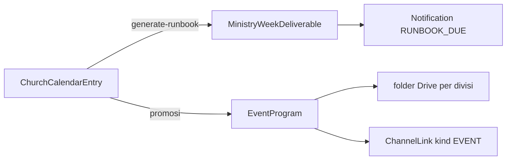

# Kalender Gerejawi GEHC

> Sumber kode: [`server/lib/church-year.mjs`](../../server/lib/church-year.mjs) · Data: tabel `church_calendar_entries`
> Runbook: [`server/lib/runbook-template.mjs`](../../server/lib/runbook-template.mjs)

## 1. Prinsip

- Kalender menjawab **kapan**; [`ChurchProgram`](../../prisma/schema.prisma) (payung gerejawi) menjawab **siapa yang bertanggung jawab**. Dua tabel terpisah, terhubung lewat `churchProgramId` opsional.
- Hari raya bergerak **dihitung**, tidak di-hardcode per tahun. Algoritma Computus (Anonymous Gregorian) menurunkan Paskah, lalu seluruh turunannya. Karena itu 2027, 2028, dan seterusnya otomatis benar.
- `season` **diturunkan dari tanggal** (`deriveSeason`), bukan diisi manual lewat dropdown.

## 2. Tiga sumber entri (`source`)

| `source` | Isi | Boleh dihapus? |
|---|---|---|
| `LITURGICAL` | Rabu Abu, Palma, Kamis Putih, Jumat Agung, Paskah, Paskah II, Kenaikan, Pentakosta, Trinitatis, Adven I–IV, Malam Natal, Natal, Tutup/Buka Tahun | Tidak — sembunyikan dari publik |
| `GMIM_FIXED` | 12 Juni (Pekabaran Injil & Pendidikan Kristen), 30 September (HUT Bersinode), HUT Pemuda / Remaja / PKB | Tidak — sembunyikan dari publik |
| `JEMAAT` | Agenda khas GEHC, mis. HUT Jemaat, Pengucapan Syukur | Ya |

`level` melengkapi cakupan: `SINODE` · `WILAYAH` · `JEMAAT` · `KOMISI` · `KOLOM`.

## 3. Tanggal acuan

| Peringatan | Tahun basis | Catatan |
|---|---|---|
| HUT GMIM Bersinode | 1934 | 30 September. 2026 = ke-92 |
| Pekabaran Injil & Pendidikan Kristen di Tanah Minahasa | 1831 | 12 Juni. 2026 = ke-195 |
| HUT Pemuda GMIM | 1926 (PPKM) | Menempel ke **Paskah II**, karena perayaan sinodalnya dirangkaikan Selebrasi Paskah. 2026 = ke-100 |
| HUT Komisi Pelayanan Remaja Sinode | 1990 | Rabu ke-4 Januari. 2026 = ke-36 (28 Jan 2026) |
| HUT Pria Kaum Bapa GMIM | 1962 | 17 Oktober. 2026 = ke-64 |
| **HUT Jemaat GMIM Eben Haezer Cikarang** | **2019** | **23 Maret. 2026 = ke-7** |

Nomor peringatan = `tahun − tahun basis`.

## 4. Yang belum terisi

- **Pengucapan Syukur** konteks Cikarang — jadwalnya mengikuti wilayah setempat, belum dikonfirmasi.
- **HUT WKI GMIM** — tanggal pastinya belum ditemukan.

Keduanya bisa ditambahkan kapan saja sebagai entri `source: JEMAAT` lewat Portal → Program & Event → Kalender gerejawi, tanpa mengubah kode.

## 5. Tema

Tidak ada tema tahunan sinodal tunggal. Dua lapis yang berlaku:

- **Sinodal (berjalan)** — sub-tema *"Bersama-sama Mewujudkan Masyarakat Majemuk yang Pancasilais dan Berdamai dengan Segenap Ciptaan Allah"*, visi *"GMIM yang Kudus, Am dan Rasuli"*.
- **Per jemaat** — ditetapkan PHRG (Panitia Hari Raya Gerejawi) masing-masing, yang biasanya *launching* sekitar Februari dan mengawal rangkaian sepanjang tahun. Contoh 2026 di beberapa jemaat: *"Seia Sekata, Erat Bersatu, Sehati Sepikir"* (bdk. 1 Korintus 1:10).

Kalau GEHC membentuk PHRG sendiri, petakan payung `scope: BPMJ` ke PHRG dan buat payung "PHRG <tahun>" sekitar Februari.

## 6. Dari kalender ke runbook



`POST /api/church-calendar/:id/generate-runbook` menerjemahkan satu entri bertanggal menjadi checklist H-21 → H+7 sesuai RACI di [`pancatugas-operating-model.md`](pancatugas-operating-model.md) §3–§4. Tiap deliverable jatuh ke `MinistryMonthPlan` bulan yang sesuai — H-21 bisa mendarat di bulan sebelumnya, dan itu ditangani.

Idempotent: judul deliverable diberi prefiks tonggak dan nama acara, jadi generate ulang tidak menduplikasi.

Tombol **Rocket** pada entri kalender mempromosikannya menjadi event operasional dengan mengisi form Event Tim Kerja, sehingga provisioning folder Drive dan `ChannelLink` mengikuti jalur `POST /api/events` yang sudah ada.

## 7. Grid rencana bulanan

`weeks` pada `MinistryMonthPlan` berisi **satu baris per hari Minggu sebenarnya** (`sundaysInMonth`), jadi bulan dengan 5 hari Minggu dapat 5 baris. Sebelumnya grid dipaku ke tanggal 7/14/21/28 yang tidak pernah jatuh di hari Minggu.

## 8. Perintah

```powershell
npm run db:migrate:church-calendar          # buat tabel (idempotent)
npm run db:seed:church-calendar             # tahun ini + tahun depan
npm run db:seed:church-calendar:staging
node server/seed-church-calendar.mjs 2026 2027 2028
npm run test -- tests/unit/church-year.test.ts
```

Sinkron per tahun juga bisa dari UI: Portal → Program & Event → Kalender gerejawi → **Sinkron** (`POST /api/church-calendar/sync/:year`, KOMISI).

## 9. Endpoint

| Method | Path | Guard |
|---|---|---|
| GET | `/api/church-calendar/public` | publik (`isPublic` saja) |
| GET | `/api/church-calendar` | KOMISI, COMMITTEE, BPMJ, MENTOR, CO_MENTOR |
| POST | `/api/church-calendar` | KOMISI, BPMJ (selalu `source: JEMAAT`) |
| PATCH | `/api/church-calendar/:id` | KOMISI, BPMJ |
| DELETE | `/api/church-calendar/:id` | KOMISI, BPMJ (hanya `source: JEMAAT`) |
| POST | `/api/church-calendar/sync/:year` | KOMISI |
| POST | `/api/church-calendar/:id/generate-runbook` | KOMISI, COMMITTEE |
